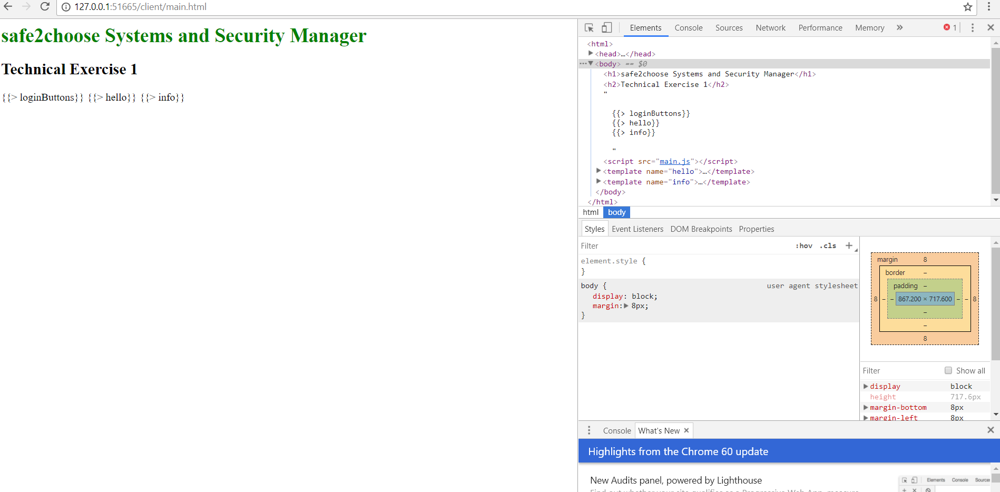
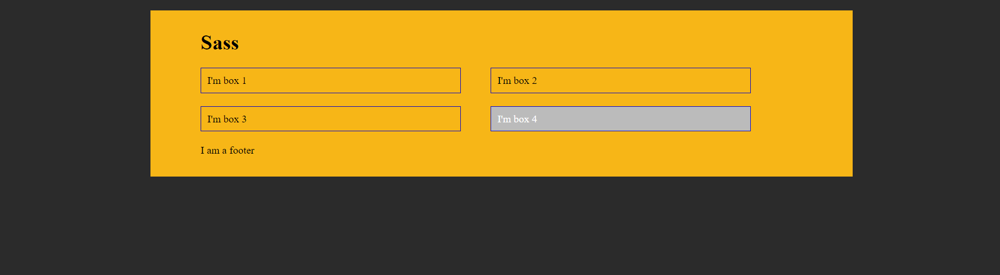

# Safe2Choose Challenge
Deadline: Monday 25 at noon.

# Step 1: Code review
* Actually this code doesn't compile. I attach the screenshot for evidence 
  

# Step 2: 3rd party Javascript integration
* Hindi and polish greetings added.
* I read the documentation, but I can't run the code to finally see if the answer is the better one.
* Greeting message for the offline form added.
* Refactored code. 
* Changes commited.

# Step 3: Wordpress customization
* Review the file `functions.php` into "Step3" folder and add comments to the function #gform_display_weeks explaining what it does.
* Register a new sidebar that will be used for advertising, the container is a div with the class "module--primary" and the title is an h3 with the class "module__title", name and description must be translatable and have "safe2choose-test" as the value for the domain parameter.
* The file "testimonials.php" is an older version of the template used for https://safe2choose.org/testimonials-on-abortion/, make the changes necessary to:
* Show the extract of every testimonial instead of the whole content
* Use the title as a hyperlink to see the full testimonial
* Implement a simple pagination at the end of the testimonials list and show only 6 testimonials per page
* Commit your changes.

# Step 4: SASS edition
* Final result
  

# Step 5: Submission
* Push all changes to Github
* Send an encrypted email to cecilia@safe2choose.org with a link to your repository.
